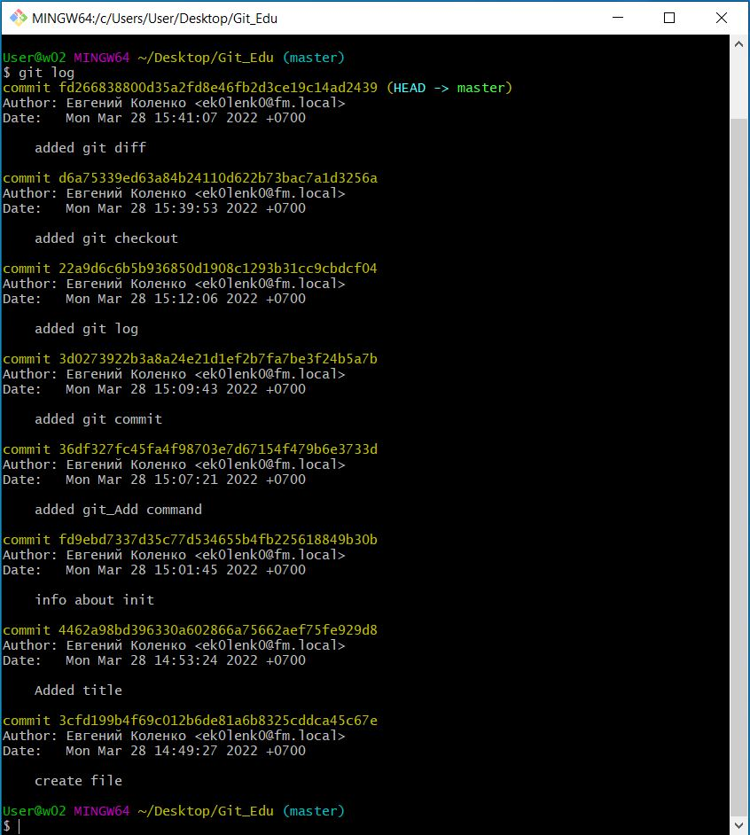

# Инструкция по работе с гитом 

## Команды Git 
---

Для того, чтобы создать локальный репозиторий, нужно:
> git init

Чтобы начать отслеживать файл с именем file_name нужно:
> git add file_name

Для фиксации отслеживаемых файлов нужно:
> git commit -m "some message"

Отобразить все добавленные коммиты:
> git log

Для возврата к предыдущему коммиту:
> git checkout commit_code

Для возврата в исходное состояние:
> git checkout master

Для просмотра разницы между зафиксированными изменениями и текущими:
> git diff

## Окно программы 
---

Окно с выводом команды ***git log***:

Для создания ветки используем команду:
> git branch branch_name

Для удаления ветки используем команду:
> git branch -d branch_name

Для копирования удаленного репозитория на себе ПК используем команду:
> git clone

Для отправки изменений локального репозитория в удаленный используй команду:
> git push

Для добавления изменений в локальный репозиторий из удаленного используй команду:
> git pull

Чтобы скопировать чужой репозиторий в свой аккаунт необходимо нажать:
> Fork

Чтобы отправить запрос на рассмотрение изменений репозитория необходимо нажать:
> Pull requests